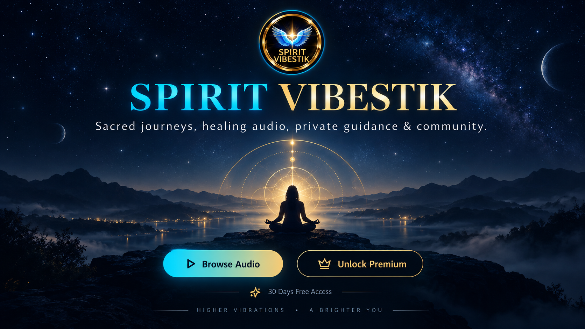
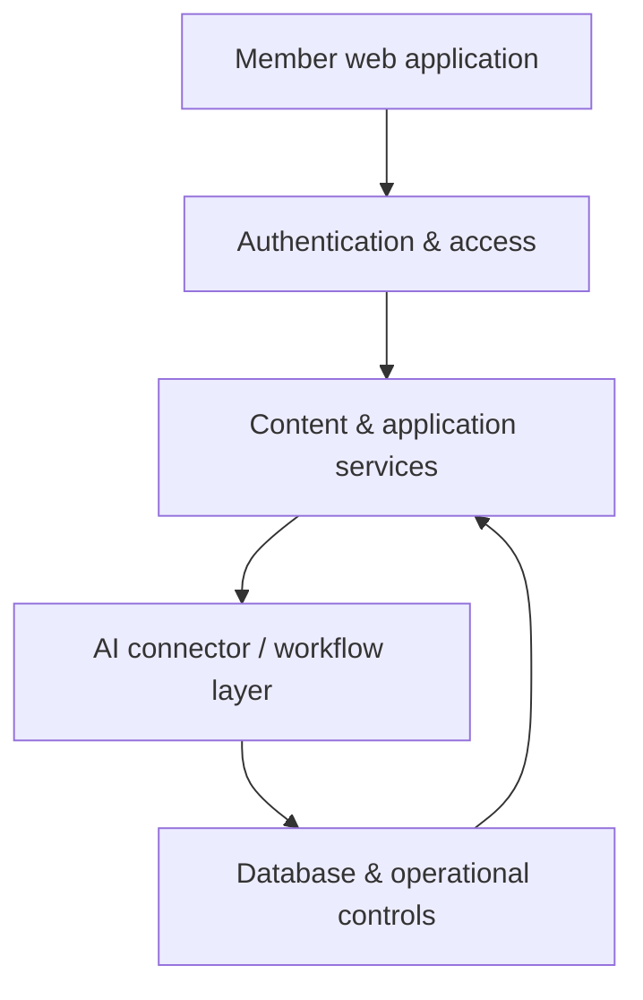

  

# Spirit Vibestik

### AI-Assisted Member & Digital Experience Platform

**Portfolio status:** Public case study · Production implementation remains private

Spirit Vibestik is an AI-assisted digital platform combining member experiences, content delivery, guided journeys, automation, community features and cloud-based application delivery.

## Product problem

A member can easily become lost when content, products, community and guidance are presented as disconnected sections.

Spirit Vibestik is designed around a structured journey so a member can understand where to begin, what to do next and which experience is relevant to them.

## My role

I shaped the product around guided onboarding, role-aware access, member journeys, protected admin operations, digital content and AI-assisted interaction.

## Selected capabilities

- Responsive member-facing application
- Authentication and protected experiences
- Role-aware access patterns
- Guided onboarding and user journeys
- Content and digital-product experiences
- AI-assisted chat and guidance workflows
- Community and support concepts
- Member account and entitlement controls
- Admin-oriented operational controls
- Cloud-connected application delivery

## Architecture

## Experience principles

- Keep public/member experiences separate from private admin controls
- Protect internal prompts, privileged routes and tools
- Use clear entitlement and role boundaries
- Design mobile-first
- Give members a clear next step
- Keep operator controls visible and manageable from the admin side

## Technical focus

React · TypeScript · authentication · role-based access · AI-assisted workflows · content systems · digital products · community features · database integrations · cloud deployment · GitHub delivery

## Public portfolio boundary

This repository intentionally excludes private prompts, member data, credentials, payment secrets, internal AI services and production infrastructure details.

---

**Shadova AI** — AI-powered business systems, automation, cloud applications and digital products.